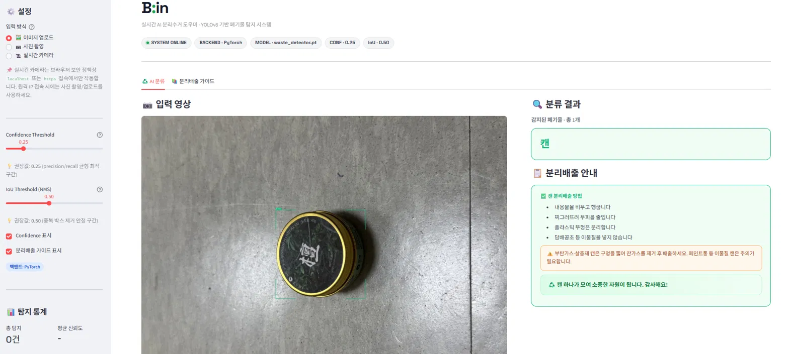

# B:in (Bin + in)
### 실시간 웹 기반 폐기물 분류 시스템 · YOLOv8 + Streamlit

---

## 0. 프로젝트 소개

B:in은 YOLOv8 기반 객체 탐지 모델을 활용하여 폐기물을 실시간으로 분류하고, 올바른 분리배출 방법을 안내하는 스마트 분리수거 웹 서비스입니다.

### 실행 화면



### 주요 기능
- 📸 이미지 업로드 / 사진 촬영 / 실시간 카메라로 폐기물 탐지
- ♻️ 4개 클래스(페트병·비닐·캔·종이) 분류 및 분리배출 방법 안내
- ⚠️ 재활용 불가 예외 품목 경고
- 🔄 클래스별 재활용 과정 안내 (출처: 분리의 정석)
- 🔖 분리배출 마크 이미지 표시
- 🛠️ 오분류 피드백 수집 (Human-in-the-loop)
- 👩‍💻 사용자 / 개발자 모드 분리

### 시연 영상
[](https://youtube.com/shorts/Frd0AHNWPKE)

### 데이터셋

- 출처: AI Hub 생활 폐기물 이미지 (데이터셋 ID: 140)
- 총 127,833장 (train 102,256 / val 25,577)
- 4개 클래스: pet_bottle(0), vinyl(1), can(2), paper(3)
- 페트병 데이터 부족으로 클래스 불균형 존재 (페트병 6,137장 vs 타 클래스 약 40,000장)

### 모델 성능 (최종)

| 클래스 | Precision | Recall | mAP@0.5 | mAP@0.5:0.95 |
|--------|-----------|--------|---------|--------------|
| 전체 | 0.981 | 0.973 | 0.990 | 0.946 |
| pet_bottle | 0.983 | 0.957 | 0.990 | 0.919 |
| vinyl | 0.980 | 0.980 | 0.991 | 0.950 |
| can | 0.985 | 0.984 | 0.990 | 0.952 |
| paper | 0.975 | 0.969 | 0.989 | 0.964 |

- 추론 속도: 0.3ms/장 (GPU 기준)
- 권장 Confidence Threshold: **0.25** / IoU Threshold: **0.50**

---

## 1. 개발 환경 및 의존성

| 항목 | 내용 |
|------|------|
| OS | Ubuntu 24.04 |
| Python | 3.10 |
| GPU | NVIDIA L40S (CUDA 12.1) |
| 주요 프레임워크 | ultralytics, streamlit, opencv-python, Pillow |
| 실시간 카메라 | streamlit-webrtc, av |
| 패키지 관리 | conda (환경명: BIN) |

전체 의존성은 `requirements.txt` 참고.

> **카메라 기능 안내**: 실시간 카메라 및 사진 촬영은 브라우저 보안 정책상 `localhost` 또는 `https` 환경에서만 동작합니다. 로컬 실행 시 자동으로 `http://localhost:8501`이 열리므로 카메라가 정상 작동합니다.

---

## 2. 설치 및 실행 방법

### 2.1 레포지토리 클론

```bash
git clone https://github.com/yeojin113/BIN.git
cd BIN
```

### 2.2 가상환경 생성 및 패키지 설치

```bash
# conda 사용 시
conda create -n BIN python=3.10
conda activate BIN
pip install -r requirements.txt

# venv 사용 시
python -m venv venv
source venv/bin/activate      # Mac/Linux
venv\Scripts\activate         # Windows
pip install -r requirements.txt
```

### 2.3 웹 앱 실행 (모델 가중치 포함)

모델 가중치(`models/waste_detector.pt`)가 레포에 포함되어 있으므로 바로 실행 가능합니다.

```bash
streamlit run app.py
```

브라우저에서 `http://localhost:8501` 접속.

### 2.4 직접 학습하려면 (선택)

AI Hub에서 생활 폐기물 이미지(ID: 140) 다운로드 후:

```bash
# 1. 전처리
python preprocess.py

# 2. 학습
python train.py --no-augment --epochs 100 --batch 16 --device 0

# 3. 앱 실행
streamlit run app.py
```

---

## 3. 데이터 파이프라인

### 3.1 원본 데이터 구조

AI Hub 생활 폐기물 이미지 데이터셋 (4개 클래스 사용):

```
data/Training/
├── [T원천]페트병류_*/         ← pet_bottle (6,137장)
├── [T원천]비닐류_*/           ← vinyl (~40,000장)
├── [T원천]캔류_*/             ← can (~40,000장)
├── [T원천]종이류_*/           ← paper (~40,000장)
└── Training_라벨링데이터/     ← JSON 라벨 (BOX / POLYGON 혼재)
```

### 3.2 전처리 핵심 과정 (`preprocess.py`)

**해결한 주요 버그 5가지:**

1. **라벨 확장자 대소문자 불일치** — `.Json` (대문자 J)을 인식 못해 전체 라벨 미적용 → 대소문자 무관 매핑으로 해결
2. **BOX/POLYGON 혼재 파싱** — JSON 내 `Drawing:"BOX"`와 `Drawing:"POLYGON"` 두 형식을 각각 파싱하도록 수정 (초기엔 POLYGON만 처리 → 12만장 누락)
3. **데이터 누수(Data Leakage)** — 프레임 단위 랜덤 split → 동일 촬영 영상의 연속 프레임이 train/val에 섞임 → 촬영 ID 단위 split으로 해결
4. **전체화면 박스 fallback 제거** — 라벨 미매칭 시 (0.5, 0.5, 1.0, 1.0) 박스 생성 → 제거하고 해당 이미지 스킵
5. **좌표 클리핑 및 해상도 정규화** — 이미지 실제 해상도 기준으로 좌표 정규화, 범위 초과 좌표 클리핑

**최종 데이터셋 통계:**

| 항목 | 수치 |
|------|------|
| 총 이미지 | 127,833장 |
| 학습 | 102,256장 |
| 검증 | 25,577장 |
| 전체화면 박스 | 0개 (완전 제거) |
| 클래스별 val 비율 | 19.9~20.1% (균등) |

### 3.3 학습 설정

- 모델: YOLOv8n (순정 파인튜닝, 3M params)
- 사전학습: COCO 기반 `yolov8n.pt`
- 적용 증강: Mosaic(1.0), MixUp(0.1), HSV 지터, 좌우반전(0.5), Scale(0.5), Random Erasing(0.4)
- 학습 명령: `python train.py --no-augment --epochs 100 --batch 16 --device 0`

---

## 4. 팀원별 역할 분담

| 이름 | 역할 |
|------|------|
| **여진** | AI Hub 데이터셋 수집, 전처리 파이프라인 구축 및 버그 수정 (5가지 핵심 버그 해결), 모델 학습, 웹 앱 기능 추가 및 반복 개선 |
| **현지** | 전체 프로젝트 구조 설계, 웹 앱 기본 틀 구성, 모델 실험, 발표 PPT 제작, 보고서 작성 |

---

## 5. 프로젝트 구조

```
BIN/
├── app.py               ← Streamlit 웹 앱 (메인 실행 파일)
├── train.py             ← YOLOv8 학습 스크립트
├── preprocess.py        ← AI Hub 데이터 → YOLOv8 형식 변환
├── export_onnx.py       ← .pt → .onnx 변환
├── inference_onnx.py    ← ONNX Runtime 추론
├── evaluate.py          ← 모델 평가
├── config.py            ← 전체 설정 중앙 관리 (하드코딩 제거)
├── utils.py             ← 전처리 / 시각화 / 분리배출 가이드
├── requirements.txt
├── models/
│   └── waste_detector.pt    ← 학습된 PyTorch 가중치 (6MB)
└── assets/marks/            ← 분리배출 마크 이미지 (18개)
```

---

## 6. 한계 및 향후 과제

- **카메라 기능**: http+IP 접속 시 브라우저 보안 정책으로 카메라 비활성화 → HTTPS 적용(ngrok/nginx+SSL)으로 해결 가능
- **클래스 불균형**: 페트병 데이터 6,137장 (타 클래스 대비 약 85% 부족) → 추가 수집 필요
- **도메인 갭**: 야외 데이터로 학습 → 실내·복잡 배경에서 bbox 위치 부정확
- **4클래스 한정**: 유리·스티로폼 등 미지원 클래스 확장 필요

---

## 7. 자주 발생하는 오류

| 오류 | 해결 방법 |
|------|-----------|
| `FileNotFoundError: models/waste_detector.pt` | `git clone` 후 `models/` 폴더 확인 |
| `CUDA out of memory` | `--batch` 줄이거나 `--device cpu` 사용 |
| `streamlit_webrtc import error` | `pip install streamlit-webrtc av` 실행 |
| 카메라가 안 켜짐 | `localhost` 또는 `https` 접속인지 확인 |